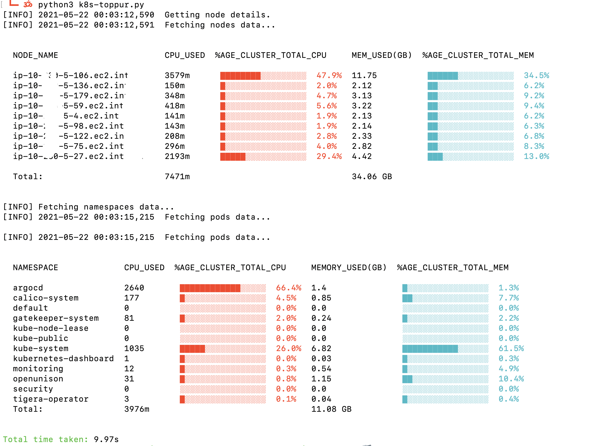
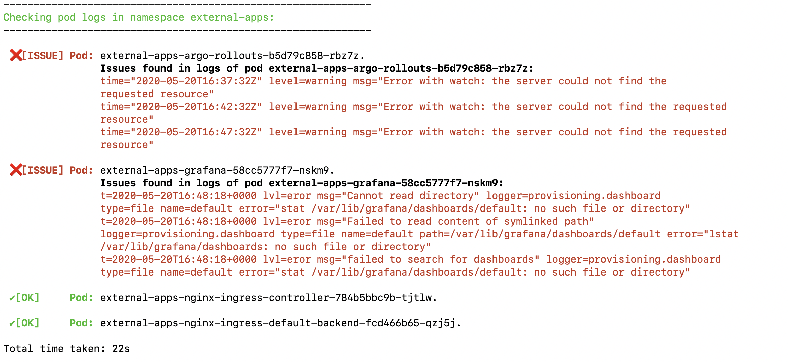

# k8s-day2-ops
This repository contain scripts for Kubernetes day 2 operations

## Index of scripts
1. kubelet scripts
    - kubelet_check.sh
        - This scripts checks kubelet status for all nodes in cluster.
2. k8s namespace operation scripts
    - debug_app_namespace.sh
        - This script helps debugging issues in a namespace.
    - get_namespace_objects.sh
        - This script fetches all kinds of objects present in namespace.
    - probe_namespace_errors.sh
        - This script tries to find errors across all pods in a namespace.
3. k8s pod operation scripts
    - container_exitcode.sh
        - This script finds exit codes for exited containers.
    - multiple_pod_delete.sh
        - This script can be used to delete multiple pods having a string common in their name.
    - pod_error_count.sh
4. k8s cluster resource calculation scripts
    - k8s-toppur:  
        - This tool calculates runtime resource usage in a cluster. 
        - based on python k8s client.
5. k8s cluster upgrade related scripts
    - k8s-deprecations.sh
        - This script lists all apiVersion deprecations in a cluster alongwith namespace: object relation.
        - This script works for k8s version > 1.x.x
    - k8s-tarmac
        - a quick tool to perform health-check of control plane workloads in a cluster post upgrade


## Sample run

### k8s-toppur



### debug_app_namespace.sh


### get_namespace_objects.sh


### probe_namespace_errors.sh



### k8s-deprecations.sh

```$ ./k8s-deprecations.sh 1.18.0 -v

Current k8s version: v1.15.10
Fetching all objects from kubenetes repo: v1.15.0...
Fetching all objects from kubenetes repo: v1.16.0...
Fetching all objects from kubenetes repo: v1.17.0...
Fetching all objects from kubenetes repo: v1.18.0...

Below is the list of deprecated apiVersion which may impact objects in cluster: 

CSINode: storage/v1beta1
ControllerRevision: apps/v1beta1
ControllerRevision: apps/v1beta2
RollbackConfig: apps/v1beta1
RollbackConfig: extensions/v1beta1
StatefulSet: apps/v1beta1
StatefulSet: apps/v1beta2


Checking if CSINode kind objects exists in the cluster... 
CSINode kind objects found which may be using deprecated apiVersion: storage/v1beta1
          ✔ 0 CSINode using deprecated apiVersion: storage/v1beta1

Checking if ControllerRevision kind objects exists in the cluster... 
ControllerRevision kind objects found which may be using deprecated apiVersion: apps/v1beta1 apps/v1beta2
          ✔ 0 ControllerRevision using deprecated apiVersion: apps/v1beta1
          ✔ 0 ControllerRevision using deprecated apiVersion: apps/v1beta2

Checking if DaemonSet kind objects exists in the cluster... 
DaemonSet kind objects found which may be using deprecated apiVersion: apps/v1beta2 extensions/v1beta1
          ✔ 0 DaemonSet using deprecated apiVersion: apps/v1beta2
          Deprecated DaemonSet found using deprecated apiVersion: extensions/v1beta1
          kube-system: calico-node
          kube-system: calico-node-etcd

Checking if Deployment kind objects exists in the cluster... 
Deployment kind objects found which may be using deprecated apiVersion: apps/v1beta1 apps/v1beta2 extensions/v1beta1
          ✔ 0 Deployment using deprecated apiVersion: apps/v1beta1
          ✔ 0 Deployment using deprecated apiVersion: apps/v1beta2
          Deprecated Deployment found using deprecated apiVersion: extensions/v1beta1
          argo-rollouts: argo-rollouts
          foo-stg-6f80c2986a84: foo-api
          foo-stg-6f80c2986a84: foo-api-worker
          foo-stg-6f80c2986a84: foo-stg-api-foo-stg-api
          ohmy-dev-6febc2d60998: ohmy-app
          ohmy-dev-6febc2d60998: app
          ohmy-dev-6febc2d60998: snow-range
          ✔ 0 Deployment using deprecated apiVersion: apps/v1beta1
          Deprecated Deployment found using deprecated apiVersion: extensions/v1beta1
          argo-rollouts: argo-rollouts
          foo-stg-6f80c2986a84: foo-api
          foo-stg-6f80c2986a84: foo-api-worker
          bar-stg-991da1f546fa: helm-operator-stg
          kube-system: kube-test
          kube-system: metrics-server
          kube-system: nginx-ingress-nginx-ingress-controller
          kube-system: nginx-ingress-nginx-ingress-default-backend
          kube-system: velero
          monitoring: monitoring-nginx-ingress-nginx-ingress-controller

Checking if DeploymentRollback kind objects exists in the cluster... 
✔ DeploymentRollback: no deprecated objects found!

Checking if IPBlock kind objects exists in the cluster... 
✔ IPBlock: no deprecated objects found!

Checking if Ingress kind objects exists in the cluster... 
Ingress kind objects found which may be using deprecated apiVersion: extensions/v1beta1
          Deprecated Ingress found using deprecated apiVersion: extensions/v1beta1
          foo-stg-6f80c2986a84: foo-api
          foo-stg-6f80c2986a84: foo-stg-api-foo-stg-api
          foo-dev-6f80c2986a84: foo-api
          foo-dev-e78264053e02: e2e-jenkins
          kube-system: argo-ui
          kube-system: dashboard-proxy-oauth2-proxy
          kube-system: dex-dex-operator-config-dex-config
          kube-system: k8s-kibana-proxy-k8s-kibana-proxy
          kube-system: kube-login-kube-login
          monitoring: prometheus-operator-prometheus

Checking if NetworkPolicy kind objects exists in the cluster... 
NetworkPolicy kind objects found which may be using deprecated apiVersion: extensions/v1beta1
          Deprecated NetworkPolicy found using deprecated apiVersion: extensions/v1beta1
          foo-stg-6f80c2986a84: foo-stg-6f80c2986a84-default-deny-policy
          foo-stg-6f80c2986a84: foo-stg-6f80c2986a84-networkpolicy-ingress
          foo-stg-6f80c2986a84: nginx-ingress-controller
          foo-stg-6f80c2986a84: nginx-ingress-default-backend
          kube-system: nginx-ingress-default-backend
          ohmy-dev-6febc2d60998: ohmy-dev-6febc2d60998-default-deny-policy
          ohmy-dev-6febc2d60998: ohmy-dev-6febc2d60998-networkpolicy-ingress

Checking if NetworkPolicyEgressRule kind objects exists in the cluster... 
✔ NetworkPolicyEgressRule: no deprecated objects found!

Checking if NetworkPolicyIngressRule kind objects exists in the cluster... 
✔ NetworkPolicyIngressRule: no deprecated objects found!

Checking if NetworkPolicyList kind objects exists in the cluster... 
✔ NetworkPolicyList: no deprecated objects found!

Checking if NetworkPolicyPeer kind objects exists in the cluster... 
✔ NetworkPolicyPeer: no deprecated objects found!

Checking if NetworkPolicyPort kind objects exists in the cluster... 
✔ NetworkPolicyPort: no deprecated objects found!

Checking if NetworkPolicySpec kind objects exists in the cluster... 
✔ NetworkPolicySpec: no deprecated objects found!

Checking if PriorityClass kind objects exists in the cluster... 
PriorityClass kind objects found which may be using deprecated apiVersion: scheduling/v1alpha1 scheduling/v1beta1
          ✔ 0 PriorityClass using deprecated apiVersion: scheduling/v1alpha1
          ✔ 0 PriorityClass using deprecated apiVersion: scheduling/v1beta1

Checking if ReplicaSet kind objects exists in the cluster... 
ReplicaSet kind objects found which may be using deprecated apiVersion: apps/v1beta2 extensions/v1beta1
          ✔ 0 ReplicaSet using deprecated apiVersion: apps/v1beta2
          Deprecated ReplicaSet found using deprecated apiVersion: extensions/v1beta1
          argo-rollouts: argo-rollouts-579bf64cd
          foo-stg-6f80c2986a84: foo-api-54f8649d8d
          foo-stg-6f80c2986a84: foo-api-5f498f5475
          foo-prod-6f80c2986a84: foo-api-worker-6857c7f9d
          foo-prod-6f80c2986a84: foo-api-worker-6d6bb98d4
          kube-system: argo-workflow-controller-78ddf46ddc
          kube-system: calico-kube-controllers-844d6d45b9
          kube-system: calico-typha-5c6768dc56
          kube-system: cluster-autoscaler-aws-cluster-autoscaler-84d974d6c6
          kube-system: coredns-5c98db65d4
          kube-system: coredns-5d4dd4b4db
          kube-system: dashboard-heapster-5c4587888f
          ohmy-dev-6febc2d60998: ohmy-app-65d774bf9f
          ohmy-dev-6febc2d60998: ohmy-app-6cc7845d5c
          ohmy-dev-6febc2d60998: snow-range-87fc9d575
          ohmy-dev-6febc2d60998: snow-range-fbc9867d6

Checking if RollbackConfig kind objects exists in the cluster... 
✔ RollbackConfig: no deprecated objects found!

Checking if StatefulSet kind objects exists in the cluster... 
StatefulSet kind objects found which may be using deprecated apiVersion: apps/v1beta1 apps/v1beta2
          ✔ 0 StatefulSet using deprecated apiVersion: apps/v1beta1
          ✔ 0 StatefulSet using deprecated apiVersion: apps/v1beta2

Upgrade path:
v1.15.10 >>> v1.16.x >>> v1.17.x >>> v1.18.x  

Total time taken: 101s

```
