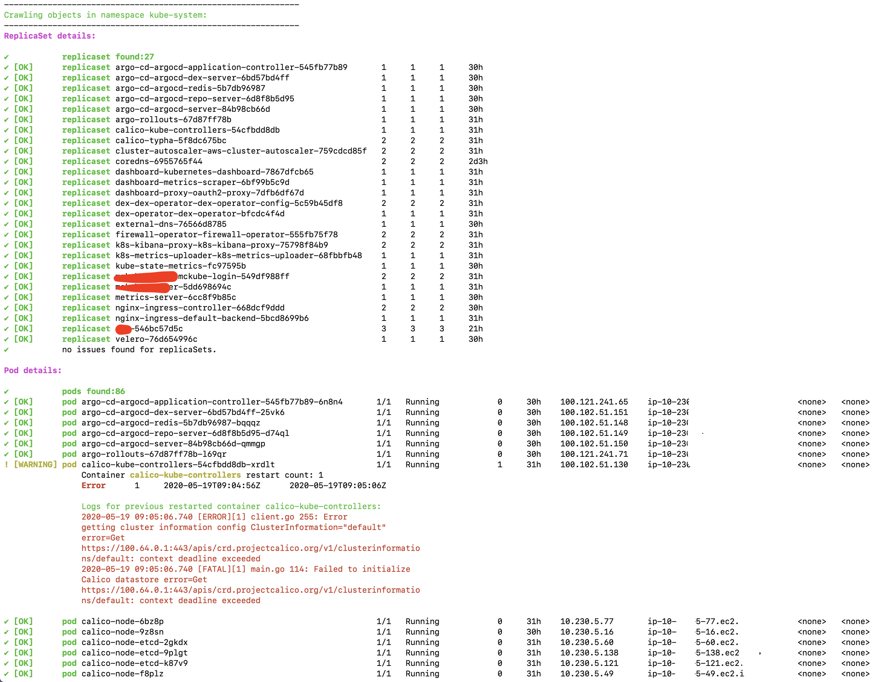
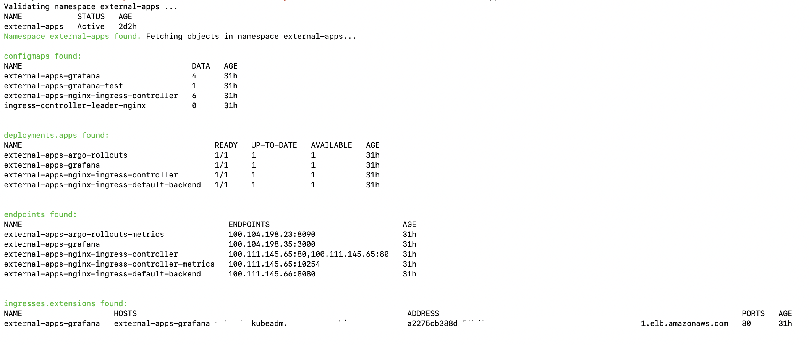

# k8s-day2-ops
This repository contain scripts for Kubernetes day 2 operations

## Index of scripts
1. kubelet scripts
    - kubelet_check.sh
        - This scripts checks kubelet status for all nodes in cluster.
2. k8s namespace operation scripts
    - debug_app_namespace.sh
        - This script helps debugging issues in a namespace.
    - get_namespace_objects.sh
        - This script fetches all kinds of objects present in namespace.
    - probe_namespace_errors.sh
        - This script tries to find errors across all pods in a namespace.
3. k8s pod operation scripts
    - container_exitcode.sh
        - This script finds exit codes for exited containers.
    - multiple_pod_delete.sh
        - This script can be used to delete multiple pods having a string common in their name.
    - pod_error_count.sh
4. k8s cluster resource calculation scripts
    - util.sh:  DEPRECATED
        - This script calculates resources in a cluster. 
5. k8s cluster upgrade related scripts
    - k8s-deprecations.sh
        - This script lists all apiVersion deprecations in a cluster alongwith namespace: object relation.
        - This script works for k8s version > 1.x.x

## Sample run

### debug_app_namespace.sh



### get_namespace_objects.sh



### probe_namespace_errors.sh


### k8s-deprecations.sh

```$ ./k8s-deprecations.sh 1.18.0 -v

Current k8s version: v1.15.10
Fetching all objects from kubenetes repo: v1.15.0...
Fetching all objects from kubenetes repo: v1.16.0...
Fetching all objects from kubenetes repo: v1.17.0...
Fetching all objects from kubenetes repo: v1.18.0...

Below is the list of deprecated apiVersion which may impact objects in cluster: 

CSINode: storage/v1beta1
ControllerRevision: apps/v1beta1
ControllerRevision: apps/v1beta2
DaemonSet: apps/v1beta2
DaemonSet: extensions/v1beta1
Deployment: apps/v1beta1
Deployment: apps/v1beta2
Deployment: extensions/v1beta1
DeploymentRollback: apps/v1beta1
DeploymentRollback: extensions/v1beta1
IPBlock: extensions/v1beta1
Ingress: extensions/v1beta1
NetworkPolicy: extensions/v1beta1
NetworkPolicyEgressRule: extensions/v1beta1
NetworkPolicyIngressRule: extensions/v1beta1
NetworkPolicyList: extensions/v1beta1
NetworkPolicyPeer: extensions/v1beta1
NetworkPolicyPort: extensions/v1beta1
NetworkPolicySpec: extensions/v1beta1
PriorityClass: scheduling/v1alpha1
PriorityClass: scheduling/v1beta1
ReplicaSet: apps/v1beta2
ReplicaSet: extensions/v1beta1
RollbackConfig: apps/v1beta1
RollbackConfig: extensions/v1beta1
StatefulSet: apps/v1beta1
StatefulSet: apps/v1beta2


Checking if CSINode kind objects exists in the cluster... 
CSINode kind objects found which may be using deprecated apiVersion: storage/v1beta1
          ✔ 0 CSINode using deprecated apiVersion: storage/v1beta1

Checking if ControllerRevision kind objects exists in the cluster... 
ControllerRevision kind objects found which may be using deprecated apiVersion: apps/v1beta1 apps/v1beta2
          ✔ 0 ControllerRevision using deprecated apiVersion: apps/v1beta1
          ✔ 0 ControllerRevision using deprecated apiVersion: apps/v1beta2

Checking if DaemonSet kind objects exists in the cluster... 
DaemonSet kind objects found which may be using deprecated apiVersion: apps/v1beta2 extensions/v1beta1
          ✔ 0 DaemonSet using deprecated apiVersion: apps/v1beta2
          Deprecated DaemonSet found using deprecated apiVersion: extensions/v1beta1
          kube-system: calico-node
          kube-system: calico-node-etcd
          kube-system: kube-proxy
          kube-system: kube2iam
          kube-system: new-relic-kubernetes
          kube-system: splunk-logging-fluentd

Checking if Deployment kind objects exists in the cluster... 
Deployment kind objects found which may be using deprecated apiVersion: apps/v1beta1 apps/v1beta2 extensions/v1beta1
          ✔ 0 Deployment using deprecated apiVersion: apps/v1beta1
          ✔ 0 Deployment using deprecated apiVersion: apps/v1beta2
          Deprecated Deployment found using deprecated apiVersion: extensions/v1beta1
          argo-rollouts: argo-rollouts
          foo-stg-6f80c2986a84: foo-api
          foo-stg-6f80c2986a84: foo-api-worker
          foo-stg-6f80c2986a84: foo-stg-api-foo-stg-api
          foo-stg-6f80c2986a84: foo-stg-api-foo-stg-api-worker
          foo-stg-6f80c2986a84: foo-test-srv01-foo-test
          foo-stg-6f80c2986a84: foo-test-srv02-foo-test
          foo-stg-6f80c2986a84: nginx-ingress-nginx-ingress-controller
          foo-stg-6f80c2986a84: nginx-ingress-nginx-ingress-default-backend
          foo-stg-6f80c2986a84: nvt-secret-service-nvt-secret-service
          foo-prod-6f80c2986a84: foo-api
          foo-prod-6f80c2986a84: foo-api-worker
          foo-prod-6f80c2986a84: foo-test-srv01-foo-test
          foo-prod-6f80c2986a84: foo-test-srv02-foo-test
          foo-prod-6f80c2986a84: nvt-secret-service-nvt-secret-service
          foo-dev-6f80c2986a84: foo-api
          foo-dev-6f80c2986a84: foo-api-worker
          foo-dev-6f80c2986a84: foo-test-srv01-foo-test
          foo-dev-6f80c2986a84: foo-test-srv02-foo-test
          foo-dev-6f80c2986a84: nginx-ingress-nginx-ingress-controller
          foo-dev-6f80c2986a84: nginx-ingress-nginx-ingress-default-backend
          foo-dev-6f80c2986a84: nvt-secret-service-nvt-secret-service
          default: argo-ui
          default: workflow-controller
          foo-dev-a93abb6f0b54: flux-dev
          foo-dev-a93abb6f0b54: flux-dev-memcached
          foo-dev-a93abb6f0b54: helm-operator-dev
          foo-prod-a93abb6f0b54: flux-prod
          foo-prod-a93abb6f0b54: flux-prod-memcached
          foo-prod-a93abb6f0b54: helm-operator-prod
          foo-stg-a93abb6f0b54: flux-stg
          foo-stg-a93abb6f0b54: flux-stg-memcached
          foo-stg-a93abb6f0b54: helm-operator-stg
          foo-dev-e78264053e02: e2e-jenkins
          foo-dev-e78264053e02: e2e-nginx-ingress-nginx-ingress-controller
          foo-dev-e78264053e02: e2e-nginx-ingress-nginx-ingress-default-backend
          foo-dev-e78264053e02: nginx
          foo-dev-e78264053e02: tiller-deploy
          bar-dev-991da1f546fa: flux-dev
          bar-dev-991da1f546fa: flux-dev-memcached
          bar-dev-991da1f546fa: helm-operator-dev
          bar-prod-991da1f546fa: flux-prod
          bar-prod-991da1f546fa: flux-prod-memcached
          bar-prod-991da1f546fa: helm-operator-prod
          bar-stg-991da1f546fa: flux-stg
          bar-stg-991da1f546fa: flux-stg-memcached
          bar-stg-991da1f546fa: helm-operator-stg
          joe-test-1: jenkins
          kube-system: argo-ui
          kube-system: argo-workflow-controller
          kube-system: calico-kube-controllers
          kube-system: calico-typha
          kube-system: cluster-autoscaler-aws-cluster-autoscaler
          kube-system: coredns
          kube-system: dashboard-heapster
          kube-system: dashboard-kubernetes-dashboard
          kube-system: dashboard-proxy-oauth2-proxy
          kube-system: dex-dex-operator-config-dex-config
          kube-system: dex-operator-dex-operator
          kube-system: external-dns
          kube-system: firewall-operator-firewall-operator
          kube-system: k8s-kibana-proxy-k8s-kibana-proxy
          kube-system: k8s-metrics-uploader-k8s-metrics-uploader
          kube-system: kube-state-metrics
          kube-system: kube-login-kube-login
          kube-system: kube-test
          kube-system: metrics-server
          kube-system: nginx-ingress-nginx-ingress-controller
          kube-system: nginx-ingress-nginx-ingress-default-backend
          kube-system: velero
          monitoring: monitoring-nginx-ingress-nginx-ingress-controller
          monitoring: monitoring-nginx-ingress-nginx-ingress-default-backend
          monitoring: prometheus-operator-kube-state-metrics
          monitoring: prometheus-operator-operator
          ohmy-dev-6febc2d60998: rpm-app
          ohmy-dev-6febc2d60998: rvolykh
          ohmy-dev-6febc2d60998: ohmy-app
          ohmy-dev-6febc2d60998: app
          ohmy-dev-6febc2d60998: snow-range
          ✔ 0 Deployment using deprecated apiVersion: apps/v1beta1
          Deprecated Deployment found using deprecated apiVersion: extensions/v1beta1
          argo-rollouts: argo-rollouts
          foo-stg-6f80c2986a84: foo-api
          foo-stg-6f80c2986a84: foo-api-worker
          foo-stg-6f80c2986a84: foo-stg-api-foo-stg-api
          foo-stg-6f80c2986a84: foo-stg-api-foo-stg-api-worker
          foo-stg-6f80c2986a84: foo-test-srv01-foo-test
          foo-stg-6f80c2986a84: foo-test-srv02-foo-test
          foo-stg-6f80c2986a84: nginx-ingress-nginx-ingress-controller
          foo-stg-6f80c2986a84: nginx-ingress-nginx-ingress-default-backend
          foo-stg-6f80c2986a84: nvt-secret-service-nvt-secret-service
          foo-prod-6f80c2986a84: foo-api
          foo-prod-6f80c2986a84: foo-api-worker
          foo-prod-6f80c2986a84: foo-test-srv01-foo-test
          foo-prod-6f80c2986a84: foo-test-srv02-foo-test
          foo-prod-6f80c2986a84: nvt-secret-service-nvt-secret-service
          foo-dev-6f80c2986a84: foo-api
          foo-dev-6f80c2986a84: foo-api-worker
          foo-dev-6f80c2986a84: foo-test-srv01-foo-test
          foo-dev-6f80c2986a84: foo-test-srv02-foo-test
          foo-dev-6f80c2986a84: nginx-ingress-nginx-ingress-controller
          foo-dev-6f80c2986a84: nginx-ingress-nginx-ingress-default-backend
          foo-dev-6f80c2986a84: nvt-secret-service-nvt-secret-service
          default: argo-ui
          default: workflow-controller
          foo-dev-a93abb6f0b54: flux-dev
          foo-dev-a93abb6f0b54: flux-dev-memcached
          foo-dev-a93abb6f0b54: helm-operator-dev
          foo-prod-a93abb6f0b54: flux-prod
          foo-prod-a93abb6f0b54: flux-prod-memcached
          foo-prod-a93abb6f0b54: helm-operator-prod
          foo-stg-a93abb6f0b54: flux-stg
          foo-stg-a93abb6f0b54: flux-stg-memcached
          foo-stg-a93abb6f0b54: helm-operator-stg
          foo-dev-e78264053e02: e2e-jenkins
          foo-dev-e78264053e02: e2e-nginx-ingress-nginx-ingress-controller
          foo-dev-e78264053e02: e2e-nginx-ingress-nginx-ingress-default-backend
          foo-dev-e78264053e02: nginx
          foo-dev-e78264053e02: tiller-deploy
          bar-dev-991da1f546fa: flux-dev
          bar-dev-991da1f546fa: flux-dev-memcached
          bar-dev-991da1f546fa: helm-operator-dev
          bar-prod-991da1f546fa: flux-prod
          bar-prod-991da1f546fa: flux-prod-memcached
          bar-prod-991da1f546fa: helm-operator-prod
          bar-stg-991da1f546fa: flux-stg
          bar-stg-991da1f546fa: flux-stg-memcached
          bar-stg-991da1f546fa: helm-operator-stg
          joe-test-1: jenkins
          kube-system: argo-ui
          kube-system: argo-workflow-controller
          kube-system: calico-kube-controllers
          kube-system: calico-typha
          kube-system: cluster-autoscaler-aws-cluster-autoscaler
          kube-system: coredns
          kube-system: dashboard-heapster
          kube-system: dashboard-kubernetes-dashboard
          kube-system: dashboard-proxy-oauth2-proxy
          kube-system: dex-dex-operator-config-dex-config
          kube-system: dex-operator-dex-operator
          kube-system: external-dns
          kube-system: firewall-operator-firewall-operator
          kube-system: k8s-kibana-proxy-k8s-kibana-proxy
          kube-system: k8s-metrics-uploader-k8s-metrics-uploader
          kube-system: kube-state-metrics
          kube-system: kube-login-kube-login
          kube-system: kube-test
          kube-system: metrics-server
          kube-system: nginx-ingress-nginx-ingress-controller
          kube-system: nginx-ingress-nginx-ingress-default-backend
          kube-system: velero
          monitoring: monitoring-nginx-ingress-nginx-ingress-controller
          monitoring: monitoring-nginx-ingress-nginx-ingress-default-backend
          monitoring: prometheus-operator-kube-state-metrics
          monitoring: prometheus-operator-operator
          ohmy-dev-6febc2d60998: rpm-app
          ohmy-dev-6febc2d60998: ohmy-app
          ohmy-dev-6febc2d60998: app
          ohmy-dev-6febc2d60998: snow-range

Checking if DeploymentRollback kind objects exists in the cluster... 
✔ DeploymentRollback: no deprecated objects found!

Checking if IPBlock kind objects exists in the cluster... 
✔ IPBlock: no deprecated objects found!

Checking if Ingress kind objects exists in the cluster... 
Ingress kind objects found which may be using deprecated apiVersion: extensions/v1beta1
          Deprecated Ingress found using deprecated apiVersion: extensions/v1beta1
          foo-stg-6f80c2986a84: foo-api
          foo-stg-6f80c2986a84: foo-stg-api-foo-stg-api
          foo-dev-6f80c2986a84: foo-api
          foo-dev-e78264053e02: e2e-jenkins
          kube-system: argo-ui
          kube-system: dashboard-proxy-oauth2-proxy
          kube-system: dex-dex-operator-config-dex-config
          kube-system: k8s-kibana-proxy-k8s-kibana-proxy
          kube-system: kube-login-kube-login
          monitoring: prometheus-operator-prometheus

Checking if NetworkPolicy kind objects exists in the cluster... 
NetworkPolicy kind objects found which may be using deprecated apiVersion: extensions/v1beta1
          Deprecated NetworkPolicy found using deprecated apiVersion: extensions/v1beta1
          foo-stg-6f80c2986a84: foo-stg-6f80c2986a84-default-deny-policy
          foo-stg-6f80c2986a84: foo-stg-6f80c2986a84-networkpolicy-ingress
          foo-stg-6f80c2986a84: nginx-ingress-controller
          foo-stg-6f80c2986a84: nginx-ingress-default-backend
          foo-prod-6f80c2986a84: foo-prod-6f80c2986a84-default-deny-policy
          foo-prod-6f80c2986a84: foo-prod-6f80c2986a84-networkpolicy-ingress
          foo-dev-6f80c2986a84: foo-dev-6f80c2986a84-default-deny-policy
          foo-dev-6f80c2986a84: foo-dev-6f80c2986a84-networkpolicy-ingress
          foo-dev-6f80c2986a84: nginx-ingress-controller
          foo-dev-6f80c2986a84: nginx-ingress-default-backend
          foo-dev-a93abb6f0b54: foo-dev-a93abb6f0b54-default-deny-policy
          foo-dev-a93abb6f0b54: foo-dev-a93abb6f0b54-networkpolicy-ingress
          foo-prod-a93abb6f0b54: foo-prod-a93abb6f0b54-default-deny-policy
          foo-prod-a93abb6f0b54: foo-prod-a93abb6f0b54-networkpolicy-ingress
          foo-stg-a93abb6f0b54: foo-stg-a93abb6f0b54-default-deny-policy
          foo-stg-a93abb6f0b54: foo-stg-a93abb6f0b54-networkpolicy-ingress
          foo-dev-e78264053e02: foo-dev-e78264053e02-default-deny-policy
          foo-dev-e78264053e02: foo-dev-e78264053e02-networkpolicy-ingress
          foo-dev-e78264053e02: e2e-nginx-ingress-controller
          foo-dev-e78264053e02: e2e-nginx-ingress-default-backend
          bar-dev-991da1f546fa: bar-dev-991da1f546fa-default-deny-policy
          bar-dev-991da1f546fa: bar-dev-991da1f546fa-networkpolicy-ingress
          bar-prod-991da1f546fa: bar-prod-991da1f546fa-default-deny-policy
          bar-prod-991da1f546fa: bar-prod-991da1f546fa-networkpolicy-ingress
          bar-stg-991da1f546fa: bar-stg-991da1f546fa-default-deny-policy
          bar-stg-991da1f546fa: bar-stg-991da1f546fa-networkpolicy-ingress
          kube-system: nginx-ingress-controller
          kube-system: nginx-ingress-default-backend
          ohmy-dev-6febc2d60998: ohmy-dev-6febc2d60998-default-deny-policy
          ohmy-dev-6febc2d60998: ohmy-dev-6febc2d60998-networkpolicy-ingress

Checking if NetworkPolicyEgressRule kind objects exists in the cluster... 
✔ NetworkPolicyEgressRule: no deprecated objects found!

Checking if NetworkPolicyIngressRule kind objects exists in the cluster... 
✔ NetworkPolicyIngressRule: no deprecated objects found!

Checking if NetworkPolicyList kind objects exists in the cluster... 
✔ NetworkPolicyList: no deprecated objects found!

Checking if NetworkPolicyPeer kind objects exists in the cluster... 
✔ NetworkPolicyPeer: no deprecated objects found!

Checking if NetworkPolicyPort kind objects exists in the cluster... 
✔ NetworkPolicyPort: no deprecated objects found!

Checking if NetworkPolicySpec kind objects exists in the cluster... 
✔ NetworkPolicySpec: no deprecated objects found!

Checking if PriorityClass kind objects exists in the cluster... 
PriorityClass kind objects found which may be using deprecated apiVersion: scheduling/v1alpha1 scheduling/v1beta1
          ✔ 0 PriorityClass using deprecated apiVersion: scheduling/v1alpha1
          ✔ 0 PriorityClass using deprecated apiVersion: scheduling/v1beta1

Checking if ReplicaSet kind objects exists in the cluster... 
ReplicaSet kind objects found which may be using deprecated apiVersion: apps/v1beta2 extensions/v1beta1
          ✔ 0 ReplicaSet using deprecated apiVersion: apps/v1beta2
          Deprecated ReplicaSet found using deprecated apiVersion: extensions/v1beta1
          argo-rollouts: argo-rollouts-579bf64cd
          foo-stg-6f80c2986a84: foo-api-54f8649d8d
          foo-stg-6f80c2986a84: foo-api-5f498f5475
          foo-stg-6f80c2986a84: foo-api-6696b6b9c8
          foo-stg-6f80c2986a84: foo-api-6d459c76d5
          foo-stg-6f80c2986a84: foo-api-6fc788b4c9
          foo-stg-6f80c2986a84: foo-api-75c6b6b4c
          foo-stg-6f80c2986a84: foo-api-778c65d486
          foo-stg-6f80c2986a84: foo-api-79f99cbc75
          foo-stg-6f80c2986a84: foo-api-7c6569c65b
          foo-stg-6f80c2986a84: foo-api-84fc9fd54c
          foo-stg-6f80c2986a84: foo-api-857dcffc75
          foo-stg-6f80c2986a84: foo-api-c4d9c9bfd
          foo-stg-6f80c2986a84: foo-api-worker-54577796d6
          foo-stg-6f80c2986a84: foo-api-worker-5497d669d7
          foo-stg-6f80c2986a84: foo-api-worker-5645b8c8b5
          foo-stg-6f80c2986a84: foo-api-worker-58b5779996
          foo-stg-6f80c2986a84: foo-api-worker-5fd8d6fbcf
          foo-stg-6f80c2986a84: foo-api-worker-646468f99f
          foo-stg-6f80c2986a84: foo-api-worker-7fdd9d749c
          foo-stg-6f80c2986a84: foo-api-worker-8476dd6f98
          foo-stg-6f80c2986a84: foo-api-worker-84b67d6b98
          foo-stg-6f80c2986a84: foo-api-worker-86c89774f
          foo-stg-6f80c2986a84: foo-api-worker-8f7f5fcc8
          foo-stg-6f80c2986a84: foo-api-worker-9bb475c9
          foo-stg-6f80c2986a84: foo-api-worker-9d8cf7bbd
          foo-stg-6f80c2986a84: foo-api-worker-bb8457b96
          foo-stg-6f80c2986a84: foo-stg-api-foo-stg-api-5867d69d4b
          foo-stg-6f80c2986a84: foo-stg-api-foo-stg-api-5979fc64c6
          foo-stg-6f80c2986a84: foo-stg-api-foo-stg-api-5fd4cbc48
          foo-stg-6f80c2986a84: foo-stg-api-foo-stg-api-6d66544f89
          foo-stg-6f80c2986a84: foo-stg-api-foo-stg-api-6f58fdf674
          foo-stg-6f80c2986a84: foo-stg-api-foo-stg-api-6f7d4ddf5
          foo-stg-6f80c2986a84: foo-stg-api-foo-stg-api-756df69d87
          foo-stg-6f80c2986a84: foo-stg-api-foo-stg-api-77b6fc8d7c
          foo-stg-6f80c2986a84: foo-stg-api-foo-stg-api-785b64d5fc
          foo-stg-6f80c2986a84: foo-stg-api-foo-stg-api-7986df6f9c
          foo-stg-6f80c2986a84: foo-stg-api-foo-stg-api-85bbbc9c84
          foo-stg-6f80c2986a84: foo-stg-api-foo-stg-api-959d87b89
          foo-stg-6f80c2986a84: foo-stg-api-foo-stg-api-worker-57465c9446
          foo-stg-6f80c2986a84: foo-stg-api-foo-stg-api-worker-57c664f64f
          foo-stg-6f80c2986a84: foo-stg-api-foo-stg-api-worker-59895b6977
          foo-stg-6f80c2986a84: foo-stg-api-foo-stg-api-worker-679d55ddf5
          foo-stg-6f80c2986a84: foo-stg-api-foo-stg-api-worker-679f896fc
          foo-stg-6f80c2986a84: foo-stg-api-foo-stg-api-worker-697f885c5f
          foo-stg-6f80c2986a84: foo-stg-api-foo-stg-api-worker-6dddd967c4
          foo-stg-6f80c2986a84: foo-stg-api-foo-stg-api-worker-75c567c96f
          foo-stg-6f80c2986a84: foo-stg-api-foo-stg-api-worker-7f66b84784
          foo-stg-6f80c2986a84: foo-stg-api-foo-stg-api-worker-7f8c697cbf
          foo-stg-6f80c2986a84: foo-stg-api-foo-stg-api-worker-84d56df4fd
          foo-stg-6f80c2986a84: foo-stg-api-foo-stg-api-worker-d7cb48c6f
          foo-stg-6f80c2986a84: foo-stg-api-foo-stg-api-worker-dd8d4d4fd
          foo-stg-6f80c2986a84: foo-test-srv01-foo-test-5485d9d849
          foo-stg-6f80c2986a84: foo-test-srv01-foo-test-674bcb5b84
          foo-stg-6f80c2986a84: foo-test-srv01-foo-test-6d55b9747f
          foo-stg-6f80c2986a84: foo-test-srv01-foo-test-7575447546
          foo-stg-6f80c2986a84: foo-test-srv01-foo-test-75d8bd845b
          foo-stg-6f80c2986a84: foo-test-srv01-foo-test-7cb7c7c7c4
          foo-stg-6f80c2986a84: foo-test-srv01-foo-test-85458b74
          foo-stg-6f80c2986a84: foo-test-srv01-foo-test-b5b88f8c
          foo-stg-6f80c2986a84: foo-test-srv02-foo-test-59b5bfccc7
          foo-stg-6f80c2986a84: foo-test-srv02-foo-test-686f4ff7c9
          foo-stg-6f80c2986a84: foo-test-srv02-foo-test-6974fb4c76
          foo-stg-6f80c2986a84: foo-test-srv02-foo-test-69df697b86
          foo-stg-6f80c2986a84: foo-test-srv02-foo-test-6fcbdd6cb
          foo-stg-6f80c2986a84: foo-test-srv02-foo-test-8695c5d895
          foo-stg-6f80c2986a84: foo-test-srv02-foo-test-dccb98b44
          foo-stg-6f80c2986a84: nginx-ingress-nginx-ingress-controller-d676579c8
          foo-stg-6f80c2986a84: nginx-ingress-nginx-ingress-default-backend-5c7f58ddff
          foo-stg-6f80c2986a84: nvt-secret-service-nvt-secret-service-5cf69d44db
          foo-prod-6f80c2986a84: foo-api-554fd5df64
          foo-prod-6f80c2986a84: foo-api-578b4bd8b
          foo-prod-6f80c2986a84: foo-api-5b5bc9b7b4
          foo-prod-6f80c2986a84: foo-api-6c6b67f4d9
          foo-prod-6f80c2986a84: foo-api-6d94498788
          foo-prod-6f80c2986a84: foo-api-788bfc67f4
          foo-prod-6f80c2986a84: foo-api-7b8958587f
          foo-prod-6f80c2986a84: foo-api-worker-54fc97bdb8
          foo-prod-6f80c2986a84: foo-api-worker-5786b5c5d8
          foo-prod-6f80c2986a84: foo-api-worker-6857c7f9d
          foo-prod-6f80c2986a84: foo-api-worker-6d6bb98d4
          foo-prod-6f80c2986a84: foo-api-worker-7b87d5d7c5
          foo-prod-6f80c2986a84: foo-api-worker-7dc89c577
          foo-prod-6f80c2986a84: foo-api-worker-8f58b5d94
          foo-prod-6f80c2986a84: foo-test-srv01-foo-test-768c5f79db
          foo-prod-6f80c2986a84: foo-test-srv01-foo-test-7b996b8f78
          foo-prod-6f80c2986a84: foo-test-srv02-foo-test-74cd7cc9f
          foo-prod-6f80c2986a84: foo-test-srv02-foo-test-7f56dfbcc
          foo-prod-6f80c2986a84: nvt-secret-service-nvt-secret-service-58d85fb97d
          foo-prod-6f80c2986a84: nvt-secret-service-nvt-secret-service-859b5847ff
          foo-dev-6f80c2986a84: foo-api-65d64c5d66
          foo-dev-6f80c2986a84: foo-api-77b9c7c6cd
          foo-dev-6f80c2986a84: foo-api-798bd47d99
          foo-dev-6f80c2986a84: foo-api-7b47bb4b64
          foo-dev-6f80c2986a84: foo-api-85ffb4bd6d
          foo-dev-6f80c2986a84: foo-api-864486bf56
          foo-dev-6f80c2986a84: foo-api-9bb6f8bfd
          foo-dev-6f80c2986a84: foo-api-cc564f74
          foo-dev-6f80c2986a84: foo-api-cdfcbd97c
          foo-dev-6f80c2986a84: foo-api-worker-54498968ff
          foo-dev-6f80c2986a84: foo-api-worker-597fbd8544
          foo-dev-6f80c2986a84: foo-api-worker-66698b4b66
          foo-dev-6f80c2986a84: foo-api-worker-66cf4bdbb4
          foo-dev-6f80c2986a84: foo-api-worker-768f45cd74
          foo-dev-6f80c2986a84: foo-api-worker-776494ddf7
          foo-dev-6f80c2986a84: foo-api-worker-778644548b
          foo-dev-6f80c2986a84: foo-api-worker-7d8f859f5b
          foo-dev-6f80c2986a84: foo-api-worker-d6ffc966d
          foo-dev-6f80c2986a84: foo-test-srv01-foo-test-655c4fc447
          foo-dev-6f80c2986a84: foo-test-srv01-foo-test-74d9ff45c4
          foo-dev-6f80c2986a84: foo-test-srv01-foo-test-77cdcd84
          foo-dev-6f80c2986a84: foo-test-srv01-foo-test-d8d986c78
          foo-dev-6f80c2986a84: foo-test-srv02-foo-test-55f5b7ccc6
          foo-dev-6f80c2986a84: foo-test-srv02-foo-test-5c6f966d68
          foo-dev-6f80c2986a84: foo-test-srv02-foo-test-5fb658bd4b
          foo-dev-6f80c2986a84: foo-test-srv02-foo-test-74cdc65949
          foo-dev-6f80c2986a84: nginx-ingress-nginx-ingress-controller-c44cd477c
          foo-dev-6f80c2986a84: nginx-ingress-nginx-ingress-default-backend-5c7f58ddff
          foo-dev-6f80c2986a84: nvt-secret-service-nvt-secret-service-68b5b79f88
          default: argo-ui-6b67c96956
          default: workflow-controller-7cf6ffb79f
          foo-dev-a93abb6f0b54: flux-dev-74fb8fbfb6
          foo-dev-a93abb6f0b54: flux-dev-memcached-5474488869
          foo-dev-a93abb6f0b54: helm-operator-dev-5f6595bf6b
          foo-prod-a93abb6f0b54: flux-prod-6cc46856f6
          foo-prod-a93abb6f0b54: flux-prod-memcached-7bb76bbfff
          foo-prod-a93abb6f0b54: helm-operator-prod-bdd6f9f4d
          foo-stg-a93abb6f0b54: flux-stg-7d659877d
          foo-stg-a93abb6f0b54: flux-stg-memcached-6ddc4d8db
          foo-stg-a93abb6f0b54: helm-operator-stg-85cf575fd4
          foo-dev-e78264053e02: e2e-jenkins-756cdc5566
          foo-dev-e78264053e02: e2e-nginx-ingress-nginx-ingress-controller-c685f79d9
          foo-dev-e78264053e02: e2e-nginx-ingress-nginx-ingress-default-backend-8964dc488
          foo-dev-e78264053e02: nginx-7bb7cd8db5
          foo-dev-e78264053e02: tiller-deploy-578bb9c54f
          foo-dev-e78264053e02: tiller-deploy-f7ff9f84f
          bar-dev-991da1f546fa: flux-dev-676646b6
          bar-dev-991da1f546fa: flux-dev-75854b5f89
          bar-dev-991da1f546fa: flux-dev-memcached-5474488869
          bar-dev-991da1f546fa: helm-operator-dev-8f8bdd797
          bar-prod-991da1f546fa: flux-prod-66d9cd5984
          bar-prod-991da1f546fa: flux-prod-memcached-7bb76bbfff
          bar-prod-991da1f546fa: helm-operator-prod-69c87b8969
          bar-stg-991da1f546fa: flux-stg-b977577fc
          bar-stg-991da1f546fa: flux-stg-memcached-6ddc4d8db
          bar-stg-991da1f546fa: helm-operator-stg-68b66964f9
          joe-test-1: jenkins-c9bbbf758
          kube-system: argo-ui-58d79b5b85
          kube-system: argo-workflow-controller-78ddf46ddc
          kube-system: calico-kube-controllers-844d6d45b9
          kube-system: calico-typha-5c6768dc56
          kube-system: cluster-autoscaler-aws-cluster-autoscaler-84d974d6c6
          kube-system: coredns-5c98db65d4
          kube-system: coredns-5d4dd4b4db
          kube-system: dashboard-heapster-5c4587888f
          kube-system: dashboard-heapster-67456fc7dc
          kube-system: dashboard-heapster-6789658dfc
          kube-system: dashboard-heapster-6d6bb5bf99
          kube-system: dashboard-heapster-6d96659b59
          kube-system: k8s-kibana-proxy-k8s-kibana-proxy-67c66c446
          kube-system: k8s-metrics-uploader-k8s-metrics-uploader-5b765555d6
          kube-system: kube-state-metrics-c99658c47
          kube-system: kube-login-kube-login-dd7b859b9
          kube-system: kube-test-788d4c45f6
          kube-system: metrics-server-84bfc945c6
          kube-system: nginx-ingress-nginx-ingress-controller-d596c774f
          kube-system: nginx-ingress-nginx-ingress-default-backend-5c7f58ddff
          kube-system: velero-5f95448fd5
          kube-system: velero-65bc8d9496
          kube-system: velero-688ddfd9d4
          monitoring: monitoring-nginx-ingress-nginx-ingress-controller-d7b7b6998
          monitoring: monitoring-nginx-ingress-nginx-ingress-default-backend-5b4ffd668d
          monitoring: prometheus-operator-kube-state-metrics-c5f866dcd
          monitoring: prometheus-operator-operator-7bdbcd48b9
          monitoring: prometheus-operator-operator-85f7fccfdf
          ohmy-dev-6febc2d60998: rpm-app-6f4bd994bb
          ohmy-dev-6febc2d60998: rvolykh-7984fb69cb
          ohmy-dev-6febc2d60998: ohmy-app-589b586f7c
          ohmy-dev-6febc2d60998: ohmy-app-599446978d
          ohmy-dev-6febc2d60998: ohmy-app-5b69fbd7df
          ohmy-dev-6febc2d60998: ohmy-app-64d595f9bd
          ohmy-dev-6febc2d60998: ohmy-app-65d774bf9f
          ohmy-dev-6febc2d60998: ohmy-app-6cc7845d5c
          ohmy-dev-6febc2d60998: ohmy-app-76d8767c98
          ohmy-dev-6febc2d60998: ohmy-app-76dbc5bc8d
          ohmy-dev-6febc2d60998: ohmy-app-9bc6fd9d
          ohmy-dev-6febc2d60998: ohmy-app-d4fb74dc4
          ohmy-dev-6febc2d60998: ohmy-app-dd4b9bc6b
          ohmy-dev-6febc2d60998: app-6cb448bc4b
          ohmy-dev-6febc2d60998: app-cc9cdd9fd
          ohmy-dev-6febc2d60998: snow-range-55dfbfb74
          ohmy-dev-6febc2d60998: snow-range-695f76d548
          ohmy-dev-6febc2d60998: snow-range-79d4ddcf9d
          ohmy-dev-6febc2d60998: snow-range-7d8495fc4c
          ohmy-dev-6febc2d60998: snow-range-84fd9fc575
          ohmy-dev-6febc2d60998: snow-range-87fc9d575
          ohmy-dev-6febc2d60998: snow-range-fbc9867d6

Checking if RollbackConfig kind objects exists in the cluster... 
✔ RollbackConfig: no deprecated objects found!

Checking if StatefulSet kind objects exists in the cluster... 
StatefulSet kind objects found which may be using deprecated apiVersion: apps/v1beta1 apps/v1beta2
          ✔ 0 StatefulSet using deprecated apiVersion: apps/v1beta1
          ✔ 0 StatefulSet using deprecated apiVersion: apps/v1beta2

Upgrade path:
v1.15.10 >>> v1.16.x >>> v1.17.x >>> v1.18.x  

Total time taken: 101s

```
