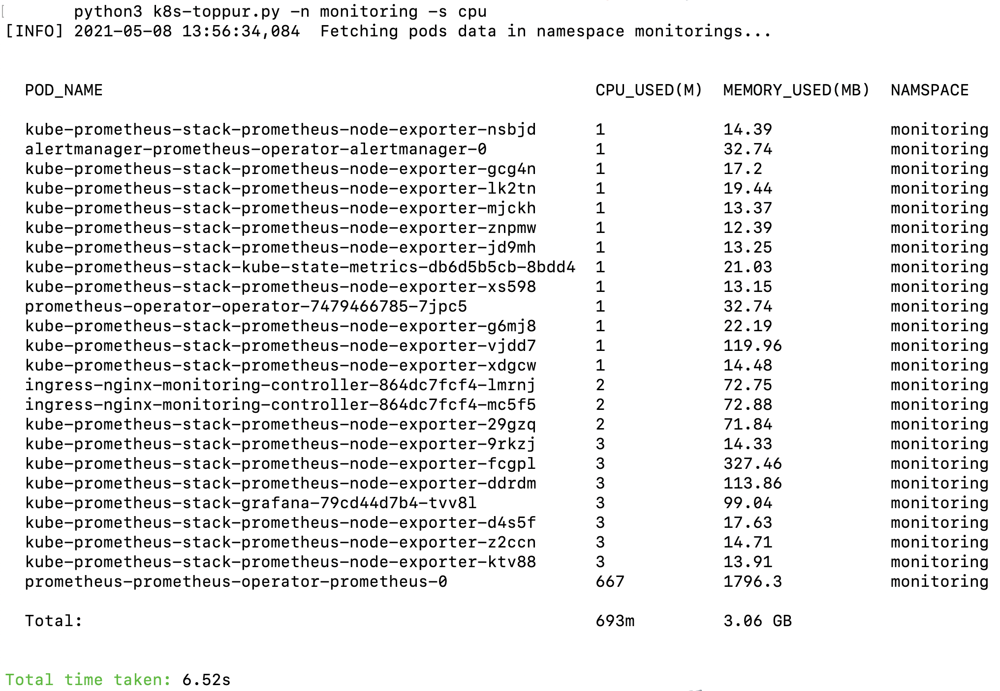
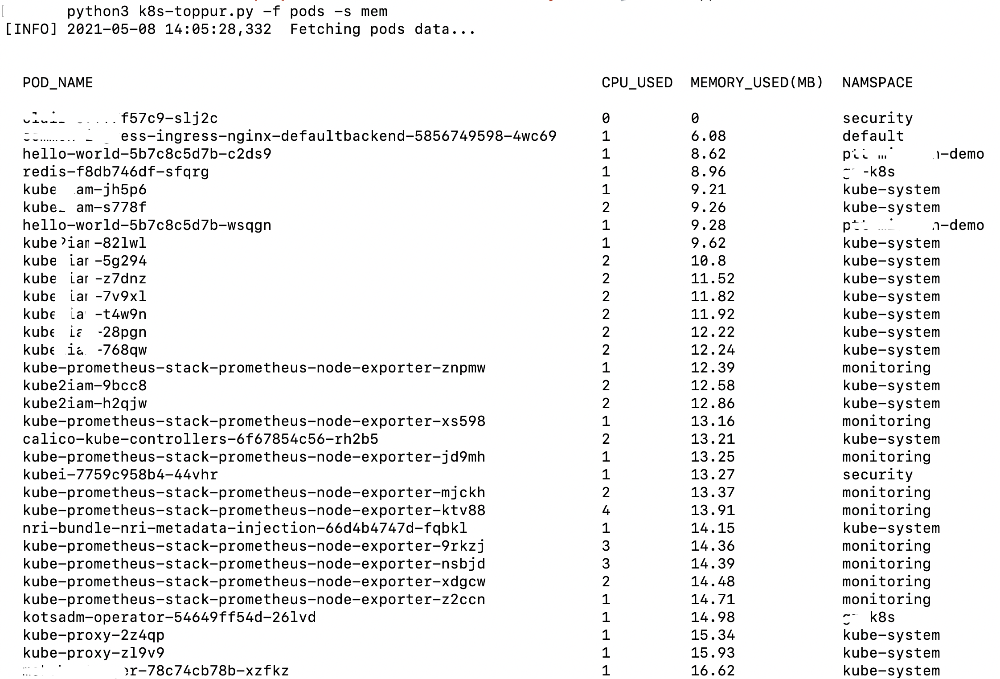

## k8s-toppur

This tool can be used to calculate run time resources usage in a k8s cluster. It pull native metrics data which is exposed by kubernetes.

### dependencies

Please install below python modules:
1. getopt
2. kubernetes python client
3. tabulate
4. packaging

### usage

python3 k8s-toppur.py -h

```
usage: k8s-toppur.py [-h] [-s] [-n] [-f] [-o]

This script can be used to see resource usage in kubernetes cluster.

Before running script export KUBECONFIG file as env:
    export KUBECONFIG=<kubeconfig file location>
    
    e.g. export KUBECONFIG=/Users/dguyhasnoname/kubeconfig

optional arguments:
  -h, --help       show this help message and exit
  -s, --sort       sort by cpu/memory. Default sorting is by name.
  -n, --namespace  check resources in specific namespace. Comma separated multiple namespace supported
  -f, --filter     filter resource usage by pods/pod_string in overall cluster.Comma separated multiple pods supported
  -o, --output     output formats csv|json|tree. Default is text on stdout.
  -p, --pods       filter resource usage by pod name in overall cluster.Comma separated multiple pods supported

```

#### To find resource usage by nodes:

```
[01:53 PM UTC 08.05.2021 ☸ api.dguyhasnoname.k8s.cloud 📁 k8s-toppur] 
 ┗━ ॐ  python3 k8s-toppur.py 
[INFO] 2021-05-08 13:53:32,435  Getting node details.
[INFO] 2021-05-08 13:53:32,435  Fetching nodes data...

        
  NODE_NAME                      CPU_USED  MEMORY_USED  
    
  ip-11-231-25-59.ec2.personal   170m      4.92 GB      
  ip-11-231-25-61.ec2.personal   214m      3.97 GB      
  ip-11-231-25-113.ec2.personal  235m      3.69 GB      
  ip-11-231-25-186.ec2.personal  181m      2.72 GB      
  ip-11-231-25-141.ec2.personal  154m      3.55 GB      
  ip-11-231-25-146.ec2.personal  111m      3.12 GB      
  ip-11-231-25-177.ec2.personal  257m      3.8 GB       
  ip-11-231-25-36.ec2.personal   106m      2.56 GB      
  ip-11-231-25-50.ec2.personal   196m      5.22 GB      
  ip-11-231-25-97.ec2.personal   745m      4.76 GB      
  ip-11-231-25-184.ec2.personal  117m      3.13 GB      
  ip-11-231-25-116.ec2.personal  140m      3911 GB      
  ip-11-231-25-73.ec2.personal   104m      2.58 GB      
  ip-11-231-25-68.ec2.personal   159m      5.32 GB      
  ip-11-231-25-153.ec2.personal  200m      4.9 GB       
  ip-11-231-25-175.ec2.personal  93m       2.46 GB      
  ip-11-231-25-189.ec2.personal  128m      5.37 GB      
  Total:                         3304m     3973.07GB    


Total time taken: 3.3s

```


#### To find resource usage by namespace:


```
[01:56 PM UTC 08.05.2021 ☸ api.dguyhasnoname.k8s.cloud 📁 k8s-toppur] 
 ┗━ ॐ  python3 k8s-toppur.py -n monitoring -s cpu 
[INFO] 2021-05-08 13:56:34,084  Fetching pods data in namespace monitorings...

          
  POD_NAME                                                  CPU_USED(M)  MEMORY_USED(MB)  NAMSPACE    
    
  kube-prometheus-stack-prometheus-node-exporter-nsbjd      1            14.39            monitoring  
  alertmanager-prometheus-operator-alertmanager-0           1            32.74            monitoring  
  kube-prometheus-stack-prometheus-node-exporter-gcg4n      1            17.2             monitoring  
  kube-prometheus-stack-prometheus-node-exporter-lk2tn      1            19.44            monitoring  
  kube-prometheus-stack-prometheus-node-exporter-mjckh      1            13.37            monitoring  
  kube-prometheus-stack-prometheus-node-exporter-znpmw      1            12.39            monitoring  
  kube-prometheus-stack-prometheus-node-exporter-jd9mh      1            13.25            monitoring  
  kube-prometheus-stack-kube-state-metrics-db6d5b5cb-8bdd4  1            21.03            monitoring  
  kube-prometheus-stack-prometheus-node-exporter-xs598      1            13.15            monitoring  
  prometheus-operator-operator-7479466785-7jpc5             1            32.74            monitoring  
  kube-prometheus-stack-prometheus-node-exporter-g6mj8      1            22.19            monitoring  
  kube-prometheus-stack-prometheus-node-exporter-vjdd7      1            119.96           monitoring  
  kube-prometheus-stack-prometheus-node-exporter-xdgcw      1            14.48            monitoring  
  ingress-nginx-monitoring-controller-864dc7fcf4-lmrnj      2            72.75            monitoring  
  ingress-nginx-monitoring-controller-864dc7fcf4-mc5f5      2            72.88            monitoring  
  kube-prometheus-stack-prometheus-node-exporter-29gzq      2            71.84            monitoring  
  kube-prometheus-stack-prometheus-node-exporter-9rkzj      3            14.33            monitoring  
  kube-prometheus-stack-prometheus-node-exporter-fcgpl      3            327.46           monitoring  
  kube-prometheus-stack-prometheus-node-exporter-ddrdm      3            113.86           monitoring  
  kube-prometheus-stack-grafana-79cd44d7b4-tvv8l            3            99.04            monitoring  
  kube-prometheus-stack-prometheus-node-exporter-d4s5f      3            17.63            monitoring  
  kube-prometheus-stack-prometheus-node-exporter-z2ccn      3            14.71            monitoring  
  kube-prometheus-stack-prometheus-node-exporter-ktv88      3            13.91            monitoring  
  prometheus-prometheus-operator-prometheus-0               667          1796.3           monitoring  
                                                                                                      
  Total:                                                    693m         3.06 GB                      


Total time taken: 6.52s
```

#### To find resource usage in a namespace:



#### To find resource usage by pods:



