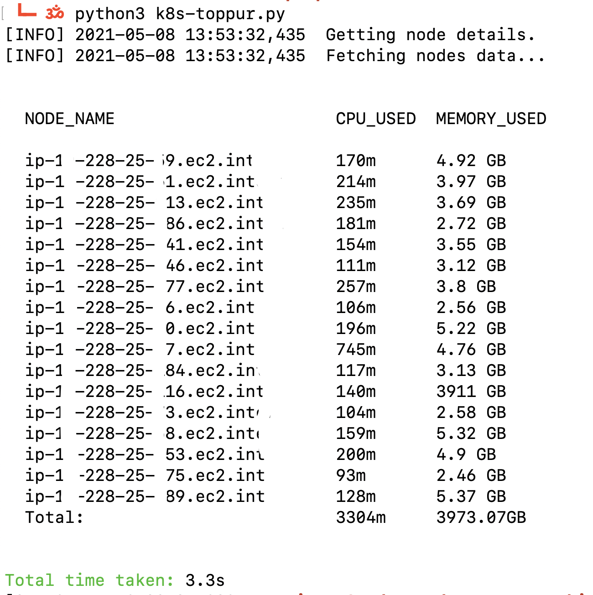
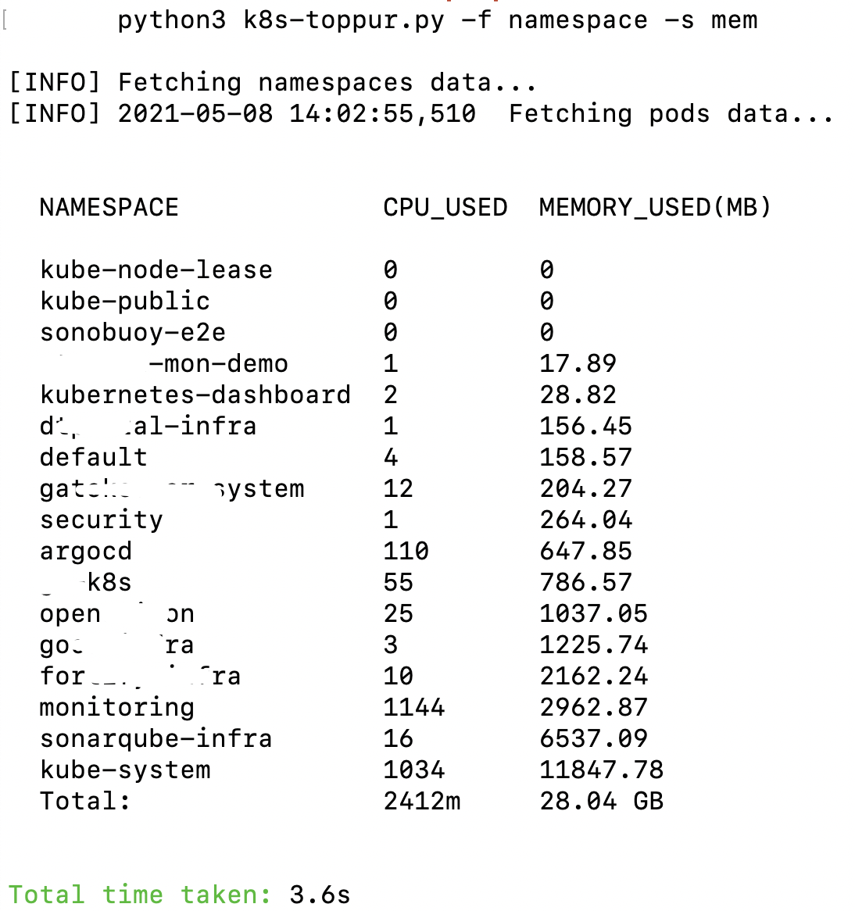

## k8s-toppur

This tool can be used to calculate run time resources usage in a k8s cluster. It pull native metrics data which is exposed by kubernetes.

### dependencies

Please install below python modules:
1. getopt
2. kubernetes python client
3. cloumnar
4. click
5. packaging

### usage

python3 k8s-toppur.py -h

```
usage: k8s-toppur.py [-h] [-s] [-n] [-f] [-o]

This script can be used to see resource usage in kubernetes cluster.

Before running script export KUBECONFIG file as env:
    export KUBECONFIG=<kubeconfig file location>
    
    e.g. export KUBECONFIG=/Users/dguyhasnoname/kubeconfig

optional arguments:
  -h, --help       show this help message and exit
  -s, --sort       sort by cpu/memory. Default sorting is by name.
  -n, --namespace  check resources in specific namespace.
  -f, --filter     filter resource usage by namespace|pods
  -o, --output     for output in json format pass json. Default is plain text
  ```

To find resource usage by nodes:



To find resource usage by namespace:



To find resource usage in a namespace:


To find resource usage by pods:


